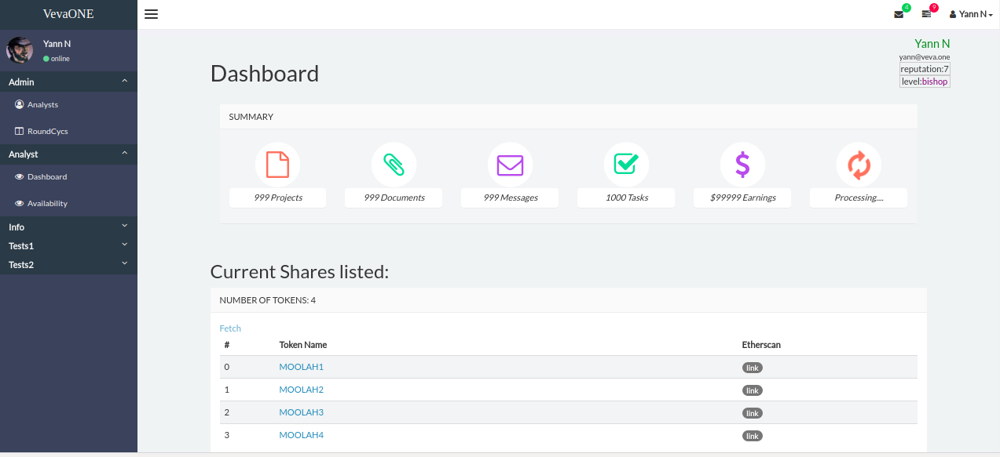
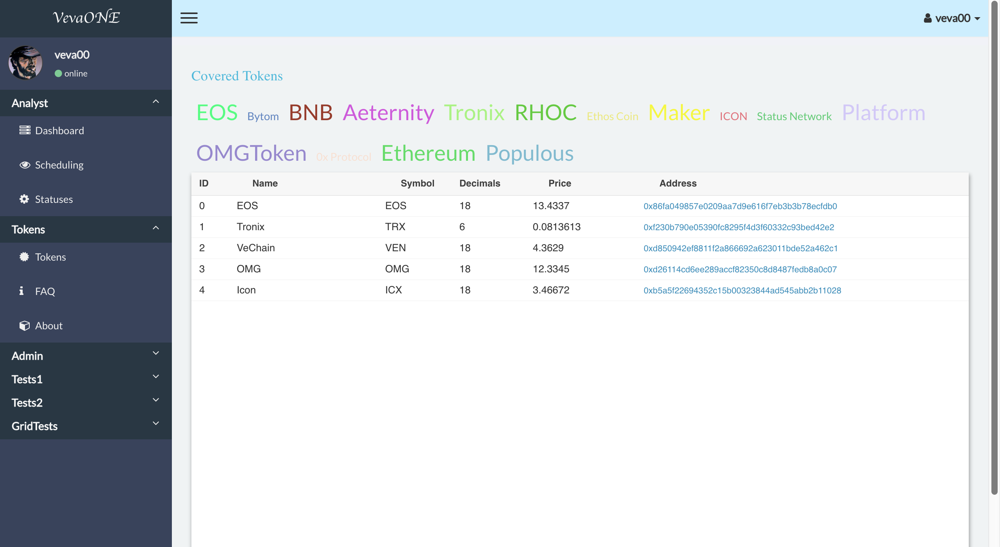
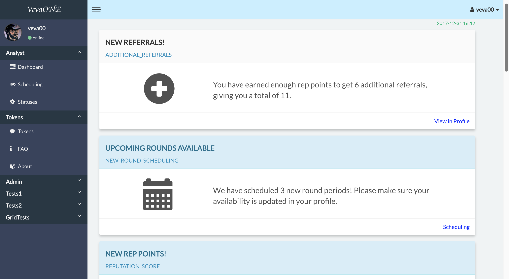

# Veva One Decentralized Token Ratings Agency

## Motivation
Peer-to-peer distributed Blockchain with autonomous contracts offers anyone the ability to issue Tokens for exchange on distributed networks, represented as "Currencies" in the traditional money fiat sense, or as "Securities" in the traditional stock sense

Tokens can be moved by anyone with access to transfer rights.  

Once tokens trade openly on an exchange market (usually following an "Initial Coin Offering"), real money is involved, and many questions arise about Trust and Governance--to date much along the lines of thinking developed over a century of securities practices and legal action. 

Traditional government authorities today are showing strong inclination to intervene in Token Markets, the putative desire being to protect people from fraud and false promises, or to otherwise provide an acceptable legal framework for token trading.

What isn't clear is whether centralized authorities are the best way to cope with free speech activity on decentralized networks, in either legalistic ways or even whether pragmatic intervention is even a reasonable possibility.

## Governance on the Blockchain
Decentralized networks no doubt will do better if Governance is built into them from the ground up with a variety of built-in safeguards, avoiding need for intervention from external authorities

### Adversarial Network
The Veva Rating Agency is one attempt at Governance, a model that relies on networks of trusted participants to analyze tokens, a game between participating analysts to challenge and judge authenticity and assess value.  


### Veva Rules / Flow
> A series of assessment Rounds is run for every Token under consideration, each typically is of a Month time frame.  

> A round begins by giving it a number of Veva Tokens, these tokens are to be 'won' by the participants when the Round is tallied

> Analysts express their availability for each particular round, going into a pool of analysts to be randomly chosen whenever tokens are scheduled

> To schedule a token for assessment, a jury and lead bull and bear analysts are chosen from the pool of available analysts.  

> Each member of the jury completes the Token survey to enter the Round.  

> Leads then submit their briefs on the Token.

> Following submission of Lead briefs, Jury Members re-take the survey

> Once the Round ends at the end of the round period Veva Tokens are issued, the Assessments are tallied, the Effectiveness (Sway) of each of the Leads is assessed; Jury members are given points according to a Keynesian Beauty Contest formula.  

> Veva Tokens are issued based on relative performance and the Round is finished.


## Code

Veva is a DApp, deployed on the Ethereum blockchain, of three main parts, contracts, front-end application, back-end notifier (i.e. 'game engine') to issue updates to Slack and Email, and to feed and time the RatingsAgency contract

1. Blockchain contracts (contracts directory)
AnalystRegistry -- maintains the network of participants in the Token analysis
RatingsAgency -- starts, stops, and maintains the participants and state of the rounds

2. Front-end Browser App (src directory)
The front-end is implemented in React/Redux ES6 javascript, with webpack for transpiling and deployment

3. Notifier/Cron (servers directory)
The cron app is Nodejs based with Web3 1.0. Its jobs are to pulse the Ratings Agency contract instance, schedule, activate, finish Token rounds.  At each stage Notifications are sent to participants derived on Events triggered from changes in the contract

### Events

- 
-
-
-


## Website
[Veva-One](https://www.veva.one)

## Preview





## Warning
This is a work very much in progress...use with caution
 -- the collaborators

## Content
- Veva admin screens
- Veva analyst screens
- Veva Tokens browser 

Tools
- Truffle
- Geth private server
- ReactJS 16+
- Redux
- react-hot-reload 3.1+
- React router 4
- react-router-redux 5.x
- webpack 3
- postcss
- sass
- jest
- enzyme

## Usage

### Prerequisite

> Ensure to have NodeJS v6.x MINIMUM.

### Install
```bash
npm install
```


### bundle dev mode

```bash
npm run dev
```

### dev : hot reload mode

Development mode = best dev experience (*hot reload, redux devtools extension...*).

```bash
npm run start
```

> Then go to [localhost:3001](http://localhost:3001)

### bundle production mode

```bash
npm run prod
```

### run production

In `Development` ReactJS is `not optimized at all` (*you may even find the application to be slow*).

*ReactJS shows its real power and is `amazing fast` when bundled in `production`.*

*General case:*
```bash
npm run prod-server
```
> Then go to localhost:8081

### build and deploy contracts with Truffle
> rm -rf build
> truffle compile
> truffle migrate


## What's next?
- [ ] lots of work on everything
- [ ] analyst dashboard of upcoming issues and suggestions
- [ ] rounds assessments and scoring
- [ ] event notifications connected to Slack and Email
- [ ] tests
- [ ] veva token contract


## License

The MIT License (MIT)

Copyright (c) 2018 VevaOne

Permission is hereby granted, free of charge, to any person obtaining a copy of this software and associated documentation files (the "Software"), to deal in the Software without restriction, including without limitation the rights to use, copy, modify, merge, publish, distribute, sublicense, and/or sell copies of the Software, and to permit persons to whom the Software is furnished to do so, subject to the following conditions:

The above copyright notice and this permission notice shall be included in all copies or substantial portions of the Software.

THE SOFTWARE IS PROVIDED "AS IS", WITHOUT WARRANTY OF ANY KIND, EXPRESS OR IMPLIED, INCLUDING BUT NOT LIMITED TO THE WARRANTIES OF MERCHANTABILITY, FITNESS FOR A PARTICULAR PURPOSE AND NONINFRINGEMENT. IN NO EVENT SHALL THE AUTHORS OR COPYRIGHT HOLDERS BE LIABLE FOR ANY CLAIM, DAMAGES OR OTHER LIABILITY, WHETHER IN AN ACTION OF CONTRACT, TORT OR OTHERWISE, ARISING FROM, OUT OF OR IN CONNECTION WITH THE SOFTWARE OR THE USE OR OTHER DEALINGS IN THE SOFTWARE.

